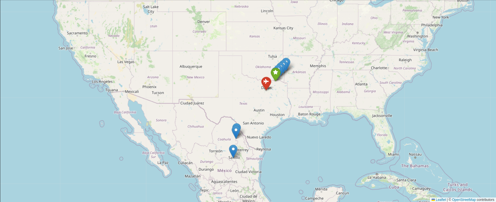
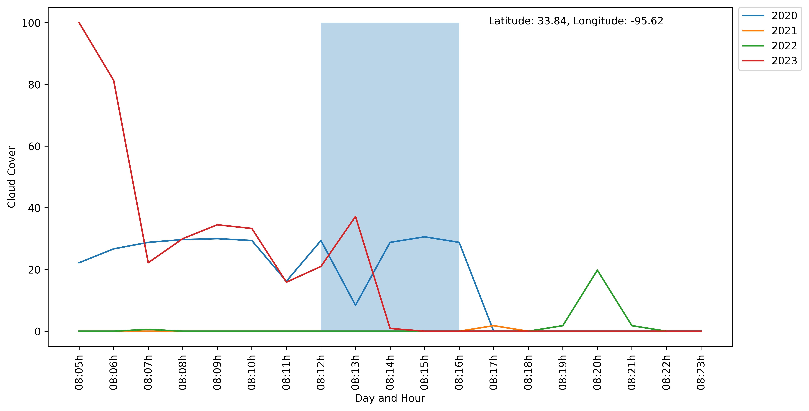

# Solar Eclipse Best Viewing Locations Finder

## Motivation

The 2024 solar eclipse presents a unique opportunity for enthusiasts and researchers alike to witness one of nature's most awe-inspiring events. However, the visibility of the eclipse can be significantly affected by local weather conditions, particularly cloud cover. This project aims to use historical weather data to analyze cloud cover and other relevant weather conditions to identify the best viewing locations along the path of totality. Additionally, the project helps users find the closest airports to these ideal viewing locations, facilitating travel planning for eclipse chasers. This program can be used for other solar eclipses in the future.

## Metrics
The following metrics were used to evaluate the best location.

- **Weather Analysis**: Retrieves and analyzes weather data, focusing on cloud cover, to identify the best locations for eclipse viewing.
- **Airport Finder**: Identifies the closest airports to the optimal viewing locations, aiding in logistical planning.
- **Flight Price**: Utilizes historical weather data to predict conditions likely to be experienced during the eclipse.

## Packages Used

- `openmeteo_requests`: For retrieving weather data.
- `requests_cache`: Caches API requests to optimize the number of calls made during development.
- `pandas`: For data manipulation and analysis.
- `folium`: For visualizating locations on a map.
- `geocoding` web service to handle coordinates data.
- `reverse_geocode`: To find the nearest town or city for a given latitude and longitude.
- ` amadeus`: Python library to get flight prices api. 

## Installation

This project is developed on Ubuntu, and the following instructions are tailored for Ubuntu users. To install the required packages, open your terminal and execute the following commands:

# Install Python 3 and pip if they are not already installed
sudo apt install python3 python3-pip

# Install the necessary Python packages
pip3 install openmeteo-requests requests-cache pandas matplotlib reverse_geocode geocoding folium amadeus

# Use Flight Price 
1. Register [amadeus](https://developers.amadeus.com/register) 
2. Create API_info.env file in your directory where you cloned the github repository.
3. Add the following lines to the .env file. 
   API_key='YOUR KEY'
   API_secret = 'YOUR SECRET KEY'
  
```


Ensure that you have the latest versions of these packages to avoid any compatibility issues.

## Usage

1. **Setup**: Ensure all dependencies are installed as mentioned above.
2. **Execution**: Run the notebook `weather.ipynb` to perform the analysis. Adjust parameters as needed to focus on specific locations or times.
3. **Results**: Analyze the output for information on the best locations and nearest airports.

```
## Results

These are the best location for the Solar Eclipse 2024. 
<figure>
  
</figure>

<figure>
  
</figure>


## Contribution

Contributions to this project are welcome! Whether it's feature enhancements, bug fixes, or improvements to the codebase, feel free to fork the repository and submit a pull request.

## License

